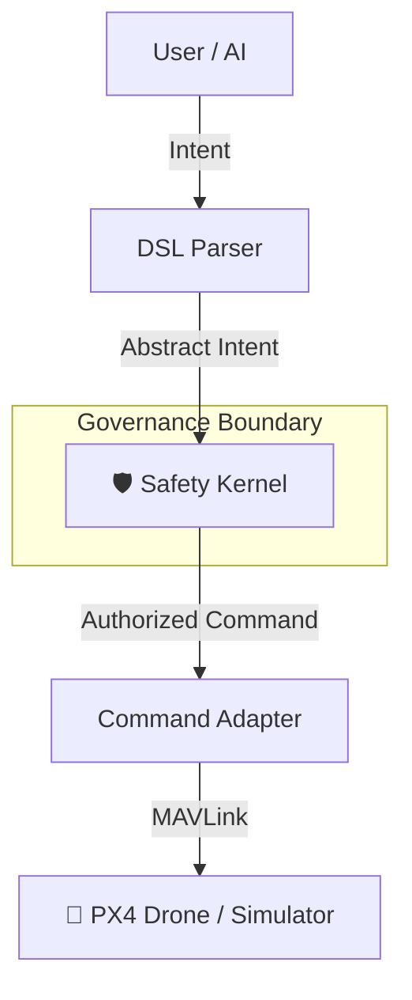

<div align="center">

# 🛩️ Governed Drone Behavior Language (GDBL)

**A safety-first, policy-governed autonomy platform for drones.**
*Where AI suggests, rules decide, and safety always overrides.*

[](https://www.python.org/)
[](https://learn.microsoft.com/en-us/windows/wsl/install)
[](LICENSE)

[Getting Started](#-getting-started) • [Documentation](#-documentation) • [Architecture](#-system-architecture) • [Contribute](#-contributing)

</div>

---

## 🚀 Overview

**GDBL (Governed Drone Behavior Language)** is a revolutionary rule-based autonomy framework. It allows drone behavior to be defined using a human-readable Domain Specific Language (DSL), while strictly enforcing non-bypassable safety constraints inspired by aviation regulations (DGCA/FAA).

Unlike traditional AI systems, GDBL strictly separates **Intent** from **Action**:

> `Intent` → `Safety Check` → `Authorization` → `Action`

**AI never controls the drone directly.** It only provides signals. The Safety Kernel has the final say.

## 🎯 Key Features

| Feature | Description |
| :--- | :--- |
| **🛡️ Non-Bypassable Safety** | The Safety Kernel is the final authority. It overrides unsafe intents from AI or Users. |
| **✍️ Human-Readable DSL** | Define behavior rules in plain English-like syntax (`RULE`, `WHEN`, `IF`, `DO`). |
| **🧠 Explainable AI** | Every decision is logged with a clear reason. No "black box" behavior. |
| **🎮 Sim & Real Hardware** | Seamlessly switch between PX4 SITL simulation and real hardware execution. |
| **⚡ Regulatory Alignment** | Designed to comply with DGCA, FAA, and EASA safety principles. |

---

## 🏗️ System Architecture



---

## 🛠️ Getting Started

### Prerequisites

*   **OS**: Windows 10/11 with **WSL 2** enabled.
*   **Python**: Version 3.10 or higher.
*   **Permissions**: Administrator access for initial setup.

### 📥 Installation

1.  **Clone the Repository**
    ```bash
    git clone <repository_url>
    cd prop
    ```

2.  **Run the One-Click Installer**
    This script sets up WSL and downloads the PX4 Autopilot firmware automatically.
    ```bash
    python backend_installer.py
    ```
    > **Note**: A system restart may be required if WSL is installed for the first time.

### ▶️ Usage

**Start the Platform**
Run the unified launcher to start the GUI, backend services, and simulation environment.

```bash
python launcher.py
```

*The launcher handles the PX4 SITL (Software In The Loop) simulation automatically.*

---

## ✍️ Behavior Language (DSL)

GDBL uses a simple, declarative syntax for defining rules.

### Syntax Structure

```gdbl
RULE <name>
WHEN <event>
IF <condition>
DO <action>
```

### Examples

#### 🔋 Battery Safety
```gdbl
RULE battery_emergency
WHEN battery_low
IF level < 20
DO RETURN_HOME
```

#### 🚧 Obstacle Avoidance
```gdbl
RULE obstacle_detect
WHEN obstacle_detected
IF distance < 2
DO STOP
```

---

## 🛡️ The Safety Kernel

The **Safety Kernel** is the heart of GDBL. It operates on a simple principle: **Safety > Mission**.

*   **Scenario**: User requests `HOVER`, AI suggests `PROCEED`, but Battery is critical.
*   **Outcome**: Kernel overrides with `RETURN_HOME`.

**Decision Log Example:**
```yaml
INTENT:   HOVER
DECISION: OVERRIDE ❌
ACTION:   RETURN_HOME 🏠
REASON:   Battery unsafe (< 20%)
```

---

## 📂 Project Structure

```bash
prop/
├── gui/                # Frontend GUI & Visualizer
├── dsl/                # DSL Parser & Interpreter
├── intent/             # Intent Generation Logic
├── safety/             # Safety Kernel (The Guardrails)
├── adapter/            # PX4 / MAVLink Communication
├── simulator/          # Context Simulator
├── logs/               # Decision & Flight Logs
├── backend_installer.py # Setup Script
└── launcher.py         # Main Entry Point
```

---

## 🗺️ Roadmap

- [ ] 📡 **Real-time Telemetry Mapping**
- [ ] 🎥 **Visual 3D Mission Playback**
- [ ] 📜 **DGCA-Compliant Rule Templates**
- [ ] 🤖 **Multi-Drone Coordination**
- [ ] 🌉 **ROS2 Bridge Integration**

---

<div align="center">

### 🧑‍💻 Author

**Komal Sai Reddy Kotha**
*Governed Autonomy | Drone Safety Systems | AI + Regulation*

*"Can drones be autonomous without being unsafe? GDBL says yes."*

</div>
